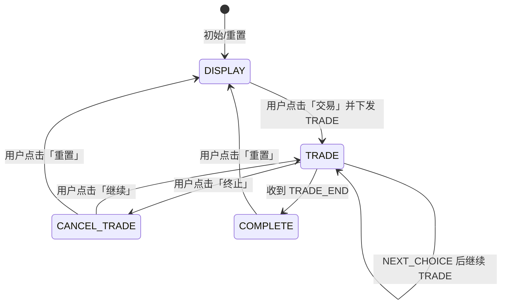

# 电力插件 - 业务流程图

## 一、整体架构与数据流

```
┌─────────────────────────────────────────────────────────────────────────────────┐
│                              用户浏览器 (目标电力交易页面)                          │
├─────────────────────────────────────────────────────────────────────────────────┤
│  ┌───────────────────────────────────────────────────────────────────────────┐  │
│  │  MAIN 世界 (execution.ts 注入)                                              │  │
│  │  • 访问页面 DOM/iframe、XMLHttpRequest 原型                                  │  │
│  │  • 解析 iframe 内挂牌表格 getMCGPTableData()                                 │  │
│  │  • 执行交易：wyzp(id)、输入电量、点击摘牌、滑块验证 executeCaptchaClickFlow     │  │
│  │  • 仅通过 postMessage 与 content 通信，不能使用 chrome.*                       │  │
│  └───────────────────────────────────────────────────────────────────────────┘  │
│                                    ↕ postMessage                                 │
│  ┌───────────────────────────────────────────────────────────────────────────┐  │
│  │  Content 世界 (content/main.ts + views/App.vue)                            │  │
│  │  • 挂载 Vue：Affix 悬浮入口 + TradeViewer 弹窗 + WaitCountdownDialog         │  │
│  │  • useBackgroundConnection：收 postMessage、转发 XHR/日志给 background       │  │
│  │  • 交易状态、挂牌数据、选单、倒计时检查、发 TRADE/NEXT_CHOICE/CANCEL_TRADE     │  │
│  └───────────────────────────────────────────────────────────────────────────┘  │
│                                    ↕ chrome.runtime (Port + sendMessage)         │
│  ┌───────────────────────────────────────────────────────────────────────────┐  │
│  │  Background (service worker)                                               │  │
│  │  • 连接池管理 content 的 Port                                               │  │
│  │  • 接收 XHR 回参 → setLogger + setSellData(chrome.storage)                  │  │
│  │  • 滑块位置 API：请求 172.16.20.88:8000/get_slider_position_percentage       │  │
│  └───────────────────────────────────────────────────────────────────────────┘  │
└─────────────────────────────────────────────────────────────────────────────────┘
                                    ↕
┌─────────────────────────────────────────────────────────────────────────────────┐
│  Popup (点击扩展图标)                                                             │
│  • 仅展示 LogViewer（日志查看）                                                   │
└─────────────────────────────────────────────────────────────────────────────────┘
```

## 二、核心业务流程图 (Mermaid)

```mermaid
flowchart TB
    subgraph 用户入口
        A[用户打开电力交易目标页]
        B[页面上显示 Affix 悬浮图标]
        C[用户点击 Affix]
    end

    subgraph 挂牌数据拉取
        D[弹窗打开 TradeViewer]
        E[initIframe: postMessage INITIFRAME]
        F[execution 初始化 iframe 引用]
        G[execution 解析 iframe 内表格 getMCGPTableData]
        H[postMessage GET_SELL_DATA 到 content]
        I[content 更新 sellData + chrome.storage]
        J[可选: 页面 XHR 请求被拦截, 回参经 content 转 background 更新 sellData]
    end

    subgraph 选单与下单
        K[TradeViewer 展示挂牌列表]
        L[用户勾选行 + 填写拟交易电量]
        M[用户点击「交易」]
        N{首笔是否有倒计时?}
        O[显示 WaitCountdownDialog 等待]
        P[倒计时结束 / 无倒计时]
        Q[tradeIframe: 构造 choiceSellData]
        R[postMessage TRADE 到 execution]
    end

    subgraph 单笔交易执行
        S[execution 收到 TRADE]
        T[setChoiceAndTrade, tradeIframe]
        U[定位当前行, 滚动到视区]
        V[updateChoice: 延迟 2s]
        W[iframe.wyzp(id) 点击摘牌]
        X[输入电量到 #zpdl]
        Y[点击 #qdzp 摘牌按钮]
        Z[executeCaptchaClickFlow 滑块验证]
    end

    subgraph 滑块验证
        Z1[取拼图块 + 背景图转 base64]
        Z2[postMessage SLIDER_POSITION_REQUEST]
        Z3[content 转发 chrome.runtime.sendMessage]
        Z4[background POST 172.16.20.88:8000]
        Z5[拿到 percentage 回传]
        Z6[execution slideToPosition 模拟拖动]
    end

    subgraph 下一笔或结束
        AA{还有 nextChoice?}
        AB[postMessage NEXT_CHOICE]
        AC[content updateTradeData, 更新队列]
        AD{下一笔有倒计时?}
        AE[显示等待倒计时弹窗]
        AF[postMessage TRADE 继续]
        AG[postMessage TRADE_END]
        AH[content 状态置为 COMPLETE]
    end

    A --> B --> C --> D
    D --> E --> F --> G --> H --> I
    I --> K
    J -.-> I
    K --> L --> M --> N
    N -->|是| O --> P
    N -->|否| P
    P --> Q --> R --> S --> T --> U --> V --> W --> X --> Y --> Z
    Z --> Z1 --> Z2 --> Z3 --> Z4 --> Z5 --> Z6
    Z6 --> AA
    AA -->|是| AB --> AC --> AD
    AD -->|是| AE --> AF --> S
    AD -->|否| AF
    AA -->|否| AG --> AH
```

## 三、关键消息类型 (postMessage / chrome)

| 方向 | 类型 | 说明 |
|------|------|------|
| content → execution | `INITIFRAME` | 初始化 iframe，拉取挂牌数据 |
| content → execution | `REQUEST_SELL_DATA` | 请求重新解析表格并回传 |
| content → execution | `TRADE` | 开始/继续执行当前队列交易 |
| content → execution | `CANCEL_TRADE` | 终止交易 |
| execution → content | `GET_SELL_DATA` | 挂牌表格数据 |
| execution → content | `NEXT_CHOICE` | 当前笔完成，请求下一笔（可能带倒计时） |
| execution → content | `TRADE_END` | 全部完成 |
| execution → content | `LOG_INFO` | 日志 |
| execution → content | `SLIDER_POSITION_REQUEST` | 请求滑块缺口位置（content 转 background） |
| content → background | `XHR_PORT_NAME` / `FETCH_PORT_NAME` | 页面 XHR/Fetch 回参（若注入） |
| content → background | `SLIDER_POSITION_API` | 调用外部 API 获取滑块百分比 |

## 四、交易状态机



## 五、数据存储 (chrome.storage.local)

| Key | 含义 |
|-----|------|
| `sellData` | 挂牌数据列表 (SELL_DATA_ITEM[]) |
| `choiceSellData` | 当前选单队列 (prevChoice, currentChoice, nextChoice) |
| `sellDataStatus` | 交易状态 (display / trade / cancel_trade / complete) |
| `tradeElectricityVolume` | 拟交易电量 |

---

以上流程图和表格基于当前代码整理，涵盖：**挂牌数据获取（iframe 解析 + 可选 XHR 拦截）→ 选单与倒计时 → 单笔执行（摘牌、输入电量、摘牌按钮、滑块验证）→ 下一笔/结束与状态机**。
